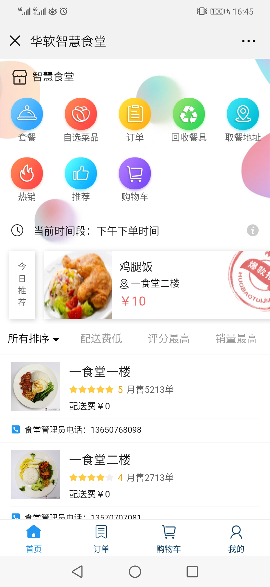
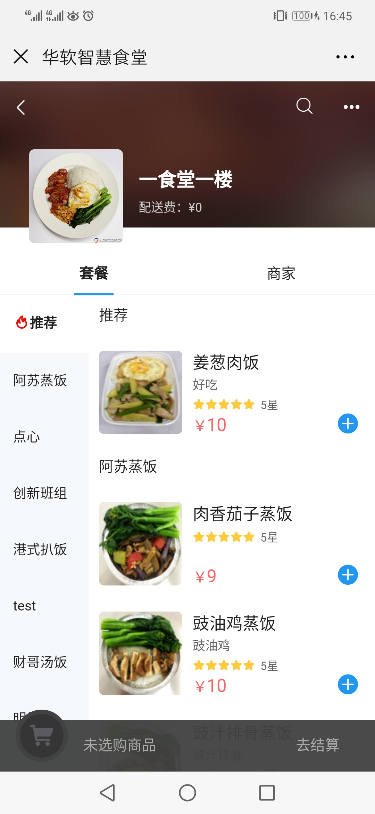

# 智慧食堂——点餐系统(微信小程序版)需求说明

## 1. 背景

随着微信小程序的推出，其更强的功能和更好的易用性吸引了大量的开发者向小程序转移。2019年年初百度、头条、支付宝纷纷推出了自己的小程序平台，目前小程序已然称为了前端主流生态。

微信公众平台H5网页的功能和易用性均不如小程序。首先小程序可以作为APP添加到用户手机桌面，也可以在微信中直接下拉进入。而微信公众号则只能在微信中找到对应的公众号进入。其次，小程序不仅提供了H5的功能，也提供了很多原生APP才有的API接口，其功能更加强大。

小程序生态在近年来已经十分繁荣，各大厂商（京东、美团、滴滴）均推出了自己的小程序。智慧食堂点餐小程序的需求也应运而生。

## 2. 需求

基于当前的微信网页端（效果如下图）

### 2.1 首页效果

### 2.2 食堂内页效果

## 3. 技术需求

1. 熟悉微信小程序技术
2. 熟悉vue.js技术
3. 了解前端发展趋势，如SPA、SSR等
4. 了解小程序开发框架，如mpvue、uniapp等