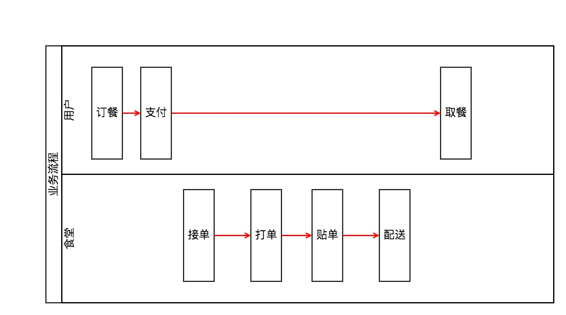
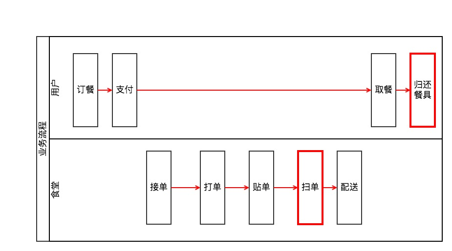
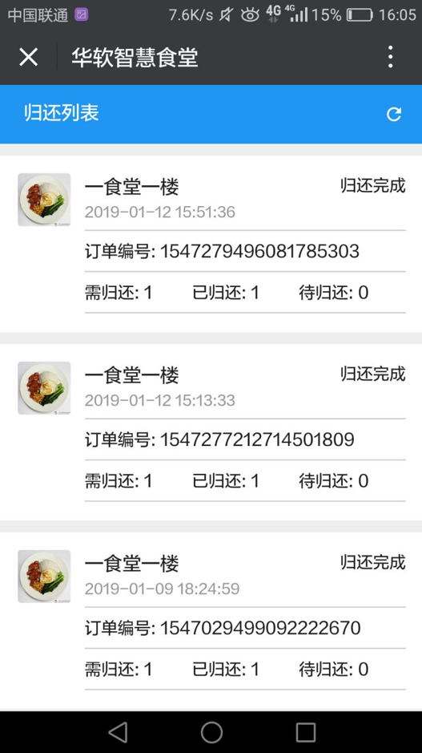

# 智慧食堂——餐具回收子系统需求说明

## 1. 背景

目前智慧食堂项目已经在学生食堂和教工食堂分别上线了点餐系统，但餐盒主要使用一次性餐盒，不符合环保要求。现准备在教工食堂使用 **可回收餐盒** 代替原有的 **一次性餐盒**。因此需要配套开发餐具回收系统，供 **教工食堂** 使用。

## 2.业务流程说明

为了说明业务流程，采用 **现有业务流程** 和 **未来回收系统上线后的新流程** 进行对比。

### 2.1 现有流程

当前业务流程如下图所示，用户在微信端进行 **订餐并支付**。食堂在管理后台 **接收订单**，并 **打印订单**（包含订单号、菜品信息、用户信息、配送信息、订单二维码）等。等待后厨做好以后，进行 **贴单**（把订单贴到餐盒上），然后进行 **配送**，把餐盒送到指定柜子指定箱子中。配送完成后，用户进行 **取餐**，食堂进行清扫，业务流程结束。

### 2.2 新业务流程

新业务流程如下图所示，和原有流程对比主要改变包括：

1. 使用 **可回收餐盒** 代替一次性餐盒，新餐盒上印有 **餐盒条形码** ，每个餐盒的条形码唯一。
2. 食堂在贴单以后要进行 **扫码操作**，对于每个订单要在一定时间内扫描 **订单二维码** 和 **餐盒码**，扫码器在读取到上述信息后将两个二维码发给回收（软件）系统，由回收系统建立订单和餐盒的关联关系。（**该业务流程与图书馆刷卡借书的流程基本一致**）
3. 用户在用餐完毕后，需要到指定的回收地点 **扫描餐盒码**，进行餐具归还。（**该业务流程与图书馆还书的流程基本一致**）

## 3. 软硬件开发需求

为了配合上述回收业务流程，需要开发对应的软件系统和硬件系统。

### 3.1 硬件系统

硬件系统需要开发的功能如下：

1. 在食堂备餐过程中，需要提供一个`双码同扫`硬件，该硬件读取 **订单二维码** 数据和 **餐盒码** 数据，调用 **软件接口1** 将两个数据发送给软件系统。

    该硬件需要 **保证数据没有乱序** 。因为食堂扫码人员如果连续扫两个订单二维码或者连续扫两个餐盒码时，会出现数据无法匹配的问题，此时硬件应提示重扫。

2. 在用户归还餐具过程中，需要提供一个`扫餐盒码`硬件，该硬件读取 **餐盒码** 数据，调用 **软件接口2** 将餐盒码数据发送给软件系统。

---

### 3.2 软件系统

#### 1. 接口层 ：提供2个服务接口（API）
    
**API 1 ：建立订单和餐盒的关联**

该接口接收硬件端发送的GET或POST请求，读取 **订单二维码** 和 **餐盒码数据**，解析订单二维码获取用户信息，将 **订单号、餐盒号、用户名、下单时间、归还状态、待回收餐具数量** 等数据写入数据库表。

**API 2 ：归还餐具**

该接口接收硬件端发送的GET或POST请求，读取 **餐盒码数据** ，在对应的数据库表中进行查询，并更新对应的数据。如将`待归还餐具数量`减一，归还状态更新为`已归还`，记录`归还时间`。

#### 2. 微信端 ：向用户提供餐具回收页面

该页面 **显示** 用户待归还餐具的信息，显示用户订单中需要归还的订单编号、归还状态等信息。效果图如下所示。

#### 3. 管理后台 ：需要提供回收餐具的管理后台页面

管理后台 **显示** 所有用户的待回收订单的订单号、餐盒号、用户ID、用户姓名、回收状态、待回收数量、下单时间、回收时间等信息。并提供 **修改回收状态** 功能。效果图如下所示。

#### 4. 定时任务 ：检测每日餐具归还状态

在每天0点执行定时任务，任务内容包括：

- 检测餐具回收数据表中是否有餐具没有回收，修改对应的用户状态为 **限制下单状态**
- 检测 **限制下单状态的用户**，其餐具是否已经归还，如果已经归还，将其用户状态更改为 **正常**

#### 5. 现有订餐系统 ：

理论上讲，回收系统可以和当前点餐系统完全独立，做到非侵入开发和部署，但用户黑名单机制涉及到修改现有系统。

现有系统需要在用户下单时进行判断，如果用户是 **限制下单用户**，那么不允许进入下单和支付流程，并提示 **您有餐具待归还，归还以后次日恢复正常下单**